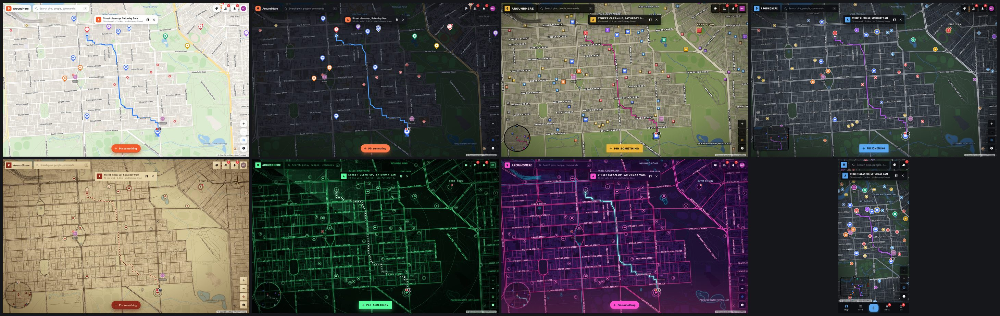
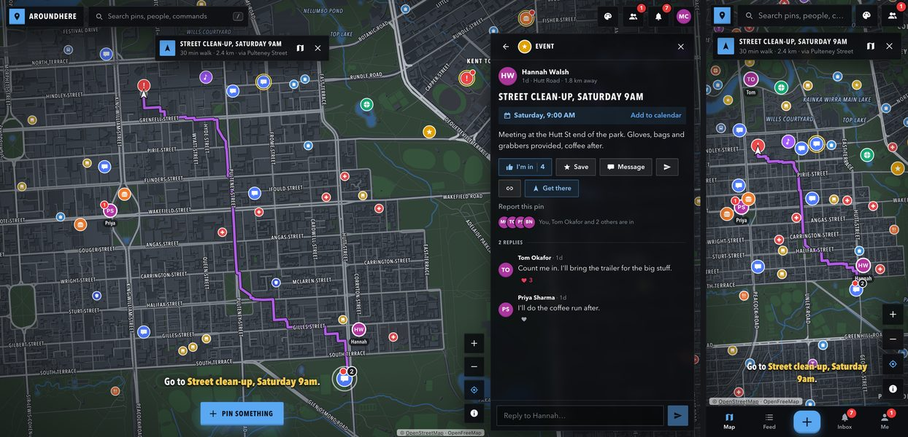

# AroundHere

A community social map for neighbours. Anyone can make an account and drop a
pin on what's going on:

- Hosting a BBQ? Looking for people to hang out with?
- Someone dumping rubbish on your street? Lost cat? Local gossip?
- Want to see if the neighbours would back a bench in the park?



*Day, Night, Palm Coast, Metro; Frontier, Phosphor, Neon Bay, and Metro on a phone.*

What you can do:

- **Pins are threads.** Reply (mention people with `@`, heart a good reply), say you're in, save,
  or share. Answer a reply and it nests under it, Reddit-style: whoever you
  answered hears about it, and the line down a thread's side folds it away. A
  comment taken back after others answered it stays as "[deleted]", so the
  thread under it isn't lost. Give a pin a time and it counts down in the feed, shows under
  Soon, ripples on the map while it's on, and goes to your calendar in a tap;
  anything you're in on gets you a word an hour before.
- **City blocks, and what the neighbours make of them.** Tap the map between
  streets and that block opens: the app finds it from the map's own streets,
  and it's the same block for everyone from then on. People give it names and
  write on it (a rumour, a joke, what used to be here), and vote each line up
  or down, Reddit-style: the best-liked name becomes what the block is called,
  written across it on the map, and the best-liked lines float to the top.
  Every pin ever dropped there stays in its history. Nobody writes "lore";
  it builds up out of what people say and do.
- **Pins take over blocks.** Something that happens across a few blocks (a
  street party, a clean-up, a blackout) is pinned to them: tap the blocks when
  making the pin. They're marked out the way each style marks ground.
- **Sightings and stories, and the ones that become Legends.** Saw a bear on
  the bike path, something big in the parklands at 3am? Pin it as a Sighting,
  with a photo. Got a story about a place, the kind people tell at the pub?
  Pin it as a Story, as long as it needs. Every pin can be voted up or down,
  Reddit-style, and one voted three up is a Legend: it gets a gold star and
  stays on the map for good. Legends of a block show at the top of it.
- **Snaps.** The camera button: a photo or video from where you are, a round
  picture on the map with a ring that runs down over its day. After 24 hours
  it's gone, unless the neighbours vote it a Legend first.
- **Everyone's photos on a meetup.** Anyone can add their photos and videos to
  a pin (an event gets "Add your photos from it"), or put them in a reply; they
  show together, with whose they are.
- **Streaks and sparks.** Opening the app each day keeps a streak going and
  earns a spark (six on every seventh day); up-votes on your pins earn one
  each, and a pin becoming a Legend earns ten. Sparks buy stickers (an emoji
  dropped on the map for a day: footprints where the thing was seen, a ghost
  on the old gaol) and boosts (a pin that glows on the map and tops the feed
  for twelve hours). Your streak and how long you've been around (Newcomer,
  Regular, Local, Local legend) show on your profile.
- **Filters that are the legend.** The sliders button says what the map shows:
  quick picks (on now, weird stuff, legends, snaps, friends), any mix of kinds
  of pin (each with how many there are, and "only" to pick just one), friends'
  pins only, and whether friends' dots, stickers, block names and the map's own
  shops and cafés show at all. A chip over the map says what's filtered and
  clears it; the choice is remembered on the device.
- **Back in time.** The clock button (or `Y`) shows the map as it was at any
  moment: the pins up then (snaps included), what the blocks were called, the legends. Pick
  how far back the timeline reaches (an hour, a day, a week, a month, a year)
  and it steps a minute at a time over the last hour, up to a day at a time over
  the year. Play runs it forward: pins drop in, names appear, legends are made.
- **Get there.** A walking route along the streets, drawn on the map (a GPS
  line in the game styles) with the minutes it takes and
  the street most of it is on. It shortens as you walk, finds a new way if
  you stray, and works for a friend too, following them as they move (one
  tap tells them you're on your way), or any street search finds. Your own
  maps app is one tap away.
- **Friends.** People around here suggests neighbours whose pins are close.
  Friends can share their location (until they stop, or just for an hour) and
  see each other on the map with their photos, only while the app is open;
  when one is a street away, you get a word about it.
- **Link-ups: dab when you meet.** Out with a friend? Open their profile and
  dab (or high-five, fist-bump, hug). They get "wants to fist bump: do it back
  while you're together", one tap answers, and both screens go off. It lands on
  the map where you met, for a day, for your friends and theirs to see, with
  sparks for both (the first one each day), and profiles count how often you've
  linked up. Nobody has to share their location: each tap brings its own fix,
  and the server only says yes if you're really together (about a street).
- **Finding your way around the lists.** Pick anything from the feed, the
  inbox, a block or search and the map looks right at it, close up, with a
  ripple so the eye finds it. Hover a row and its pin gets a ring, or, off
  screen, an arrow at the map's edge says which way and how far. "Around"
  keeps its order while you look (it measures from where you moved the map),
  a pin's header steps to the previous and next one (or `J` / `K`), and a
  half-written reply or message is still there when you come back to it.
- **Messages.** Tap a friend on the map to talk; you'll see when they're
  typing and when they've read it. Send a pin and it shows as a card.
- **Looking after each other.** Block someone (they can't message or add
  you, and their pins and replies disappear for you) or report a pin; reports
  land in the `reports` table for whoever runs the neighbourhood.
- **Accounts.** Sign up with email and password, sign in with a password or
  an emailed code, reset a forgotten password by code, change email or
  password, pick a profile photo, delete your account. New accounts get a
  short getting-started list. Settings turns off any kind of notification,
  one by one.



## Running it

You need **Node 22.12 or newer** (Vite and the current Supabase client need it).
The default setup is fully local: **no Docker, Supabase account or internet
connection needed to run it**. From a fresh clone:

```sh
npm ci
npm run setup    # a backend of your own, with the demo neighbourhood, and .env.local
npm run dev      # http://127.0.0.1:5173
```

The initial `npm ci` needs internet access or a populated npm cache. For a
machine that will be completely disconnected, install dependencies beforehand
(on that machine) and copy the whole project including `public/tiles`. After
that, setup, development and preview run without external requests.

`npm run setup` sets up the offline backend: the same database (real Postgres, compiled to
WebAssembly with PGlite, running our migrations and seed as they are) inside
the dev server, on the app's own address, with the parts of Supabase the app
uses in `server/offline.mjs`. Everything is kept in `supabase/.local`; sign-in
codes and password resets land in a mailbox page at http://127.0.0.1:5173/_mail;
and the demo area's map ships in `public/tiles`. Run setup again after pulling
to apply new migrations; it never wipes your data. `npm run setup -- --offline`
is also accepted. To start its database over, stop the server and delete
`supabase/.local/db`.

The bundled map covers central Adelaide. Other areas need to be downloaded
explicitly while online: `npm run cache:map -- west south east north`. Include
the updated `public/tiles` when sharing the project. Map searches, walking
routes and block detection use those local tiles. External maps-app links and
OAuth providers require internet; local email/password and code sign-in work
offline, with codes in `/_mail`. Each machine has its own database; separate
offline machines do not sync.

To use Docker Supabase instead, opt in with `npm run setup -- --supabase`.
This needs Docker running with Linux containers, and internet on the first
start to download the CLI and images. It builds the database and loads the
demo the first time; later setup runs apply migrations.

With Docker, to start over from nothing: `npx supabase db reset` (wipes local data). To load
the demo into a database you want to keep:

```sh
docker exec -i supabase_db_hackathon-2026 psql -U postgres < supabase/seed.sql
```

Demo accounts (password `neighbour`): `maya@aroundhere.demo`,
`tom@aroundhere.demo`, `priya@aroundhere.demo`, `lucas@aroundhere.demo`,
`hannah@aroundhere.demo`, `ben@aroundhere.demo`. Maya has friends on the map,
a friend request waiting and unread messages. In development the sign-in
sheet has one-tap buttons for them (never in a production build).

With Docker Supabase, emails (sign-in codes, password resets) land in Mailpit
at http://127.0.0.1:54324. With the default offline backend, use `/_mail` on
the app's address.

To use it on a phone over Tailscale, connect both devices to the same tailnet.
Serve the built app on port 5185; with Docker Supabase the development server
can keep running on 5173 while you edit. (With the offline backend only one
server at a time can have the database, so stop `npm run dev` first; the
preview says so if you forget.) Build and start it in one terminal:

```sh
npm run build
npm run preview -- --port 5185
```

In another terminal, point the existing HTTPS address at that preview:

```sh
tailscale serve --bg --https=443 http://127.0.0.1:5185
```

On the first run, follow Tailscale's link to enable HTTPS. Open the HTTPS URL
printed by the command on your phone, with Tailscale connected. Keep the Mac
awake and the preview server running. The current Mac's URL is
`https://nicks-macbook-pro.tail1185f0.ts.net/`; another Mac needs its own
hostname (from `tailscale status`) added to `server.allowedHosts` in
`vite.config.ts`.

The preview uses the same backend as the development server, with auth,
database, storage and realtime on the same HTTPS address. Location needs this
HTTPS URL; use it without `:5173` or `:5185`. To stop sharing this app, run
`tailscale serve --https=443 off`.

After code changes, build again and refresh the phone. This avoids serving
development modules and reloads over a slower Tailscale relay connection.

Shared locations only count while they're fresh (a real phone refreshes its
own), so the demo neighbours fade after half an hour and leave the map after
half a day. Before a demo, put the whole neighbourhood back (friends on the
map, Maya's unread messages and waiting friend request, hearts on replies); it
touches only the demo accounts:

```sh
npm run demo:reset
```

It works on either backend (offline, with or without the dev server running),
and also brings the demo's snaps back to having most of their day left and the
Rymill Park picnic back to on now.

## Putting it online

For a short DigitalOcean deployment of the frontend, database, auth, storage
and realtime on one Droplet, see [deploy/README.md](deploy/README.md).

The frontend is a static build (`npm run build`, then serve `dist/`). For a
hosted Supabase project:

```sh
supabase link --project-ref <your project>
supabase db push                    # applies supabase/migrations
```

Then, in the dashboard: set the Site URL to where the frontend lives, and
copy the two email templates in `supabase/templates/` (sign-in code and
password reset) into Authentication → Email Templates, so emails carry a
6-digit code the app asks for. Don't run `seed.sql` there; it's demo data.

## Demo in two minutes

1. Open the app signed out: the map of Adelaide with pins, the feed beside it.
   Hover a pin, then press `T` a few times to go through the map styles.
2. Sign in as `maya@aroundhere.demo` / `neighbour`. Her friends Tom, Priya and
   Hannah are on the map; Tom has sent her a message (red badge on his dot).
   Click Tom to open the chat.
3. In a second browser (or a private window) sign in as `tom@aroundhere.demo`
   and open his chat with Maya: type, and Maya sees "typing…"; send, and it
   arrives live, with "seen" once she's looked.
4. As Tom, press `N`, pick Event, give it a time an hour from now and post: it
   pops up on Maya's map with a ripple, and she gets a notification.
5. As Maya, open Hannah's street clean-up and press Get there: the way along
   the streets, with the time it takes. Press `T` for Metro to see it as a
   purple GPS line. (It starts from where you really are;
   away from Adelaide, set a location near the city centre in the browser's
   dev tools, under Sensors.)
6. As Maya, open the filters (the sliders button) and pick Weird stuff: the
   sightings and stories. Open "Something big on the Torrens path": a Legend,
   with footprint stickers beside it on the map. Vote on "Lights over the
   parklands" and watch it get closer to a Legend. Press `S` (or the camera)
   to post a snap, then the sticker button to spend Maya's sparks.
7. Tap Dumpling Alley on the map: its names and what people say about it, with
   votes and answers, and its pins. Press `Y` and play the week forward.
8. Maya and Tom meet up: give both browsers the same spot in dev tools
   (Sensors). As Tom, open Maya's profile, pick the fist and press Fist bump
   Maya. Maya is told; in her inbox (Activity), Fist bump back: the move goes
   off on both screens and the link-up lands on the map, beside Tom and Ben's.
   Her profile of Tom now says how often they've linked up.
9. On a phone (or the browser's phone view): the tab bar, sheets you drag up
   and down, pinch to zoom, and the locate button that follows you around.

## Map styles

Press `T` to cycle, or pick one in Settings.

| Style      | Look |
|------------|------|
| Sun        | Day while the sun is up where you are, Night after (worked out from the sun's position, no service) |
| Day        | Clean and bright |
| Night      | Dark, easy on the eyes |
| Palm Coast | Sun-bleached 2004 console map: square blips, fat outlined caps |
| Metro      | Modern pause-menu atlas: dark slate, round blips, condensed type |
| Frontier   | Hand-inked survey map on parchment: wobbly ink, hatched water, tree marks |
| Phosphor   | Green CRT tracking screen with glow, scanlines and a sweep |
| Neon Bay   | Eighties beachfront nights: hot pink roads glowing over purple, a low sunset |

Each style changes the map, the blips and people, the whole interface, and the
screen effect on top. The game styles cover the map in place blips from
further out, like a pause-menu map; the legend (the `i` button) says what
they mean. Setting off somewhere, they say so the way their games do, with
a mission line at the bottom ("Go to the street clean-up."), and messages go
up top left, each style in its own way: a help box, an inked band, a line of
terminal output, a neon-edged box.

Sounds are synthesized in the browser, no audio files: each style plays its
own short sting when you post, resolve or make a friend (a plucked-string
arpeggio for Frontier, an 8-bit climb for Palm Coast, a filtered synth run
for Neon Bay…) and a tick for messages. Settings turns them off.

## Keys

`/` or `Ctrl K` search pins, people, streets and commands (fuzzy: `rndl` finds
Rundle; `walk rundle mall` walks you there) · `N` new pin ·
`J` `K` next and previous pin · `L` where am I (follows you until you move the map) ·
`G` get there on foot (again to stop) · `Y` back in time · `S` snap ·
`T` next map style · `F` friends · `I` inbox · arrows move the map · `+` `−`
zoom · `Esc` close

On phones: the tab bar at the bottom, sheets you can drag up to full height
or down to close, pinch and double-tap to zoom, and press and hold the map to
pin something right there (right-click does the same with a mouse). It installs to the home
screen like an app.

## How it's built

Four source files, no UI or map libraries:

- `src/map.ts` draws the map. It fetches vector tiles from OpenFreeMap
  (OpenMapTiles schema), decodes the protobuf itself, paints each tile once
  per zoom level into a bitmap, and composites those every frame. Labels,
  blips, pins and people are placed per frame in screen space so they never
  overlap or get cut at tile edges. Tile painting is budgeted per frame, and
  missing tiles are stood in for by scaled-up parents, so zooming stays at
  60 fps. It also handles all the input: drag with fling, wheel and pinch
  zoom, double-tap, and animated flights. Walking routes come from the same
  tiles: the roads between the two ends are joined into a graph (crossings
  found by intersecting segments, since the tiles drop vertices on straight
  lines; bridges and tunnels meet only what joins their ends) and A* walks it.
  City blocks come from the same graph, of streets this time: dead ends
  pruned, a block is a face of it, traced by walking round from the nearest
  street turning as far left as the streets allow at every corner.
- `src/data.ts` is the store. The public picture (pins, replies, people) loads
  once and stays live over Supabase realtime; the signed-in user's inbox,
  friends and saved pins load on sign-in. Every write is a plain function
  that updates Supabase and then the store.
- `src/App.tsx` is the whole interface: feed, threads, profiles, chat, inbox,
  friends and location sharing, settings, compose, accounts and the command
  palette. UI state lives in one object; anything that changes it redraws.
- `src/App.css` holds the seven themes as CSS variables, the layouts for wide
  screens (floating panels) and phones (sheets and a tab bar), and the effects.

The database is in `supabase/migrations`. Row level security does the
privacy work: messages, inbox and saved pins are private, and a location is
only readable by accepted friends while its owner shares it.

### Privacy, and how not to break it

Where people are and when they're around is the sensitive part, so:

- **Locations and online status are friends-only.** Row security on
  `locations` and `presence` lets only accepted friends read them. Your dot is
  withdrawn when the app goes out of view, and positions older than 12 hours
  are ignored.
- **Those rows are never deleted, only updated.** Supabase realtime sends
  every DELETE to every client, whatever the row security, with the row's key,
  which for these tables is a person. Stopping sharing sets `shared = false`;
  leaving sets that device's `here = false` (the server stamps `seen_at`, so
  no one's clock decides who looks online).
- **Helper functions live in the `private` schema**, which the API doesn't
  expose. In `public`, `are_friends` or `has_blocked` would tell anyone who's
  friends with or blocked whom, and `notify` would let anyone send
  notifications as anyone.
- **"Typing…" uses a private realtime channel** that only the two people in
  the chat may join (policies on `realtime.messages`).
- Blocks are private to the blocker, and `notify` stops at them.
- **Photos only come from the project's own storage.** The columns can be
  written directly, and a picture on someone's own server would tell them who
  looked at it, so whatever host a stored address names, the app fetches the
  picture from its own storage by its path in the bucket (or not at all).

Map data © OpenStreetMap contributors, tiles by OpenFreeMap.
